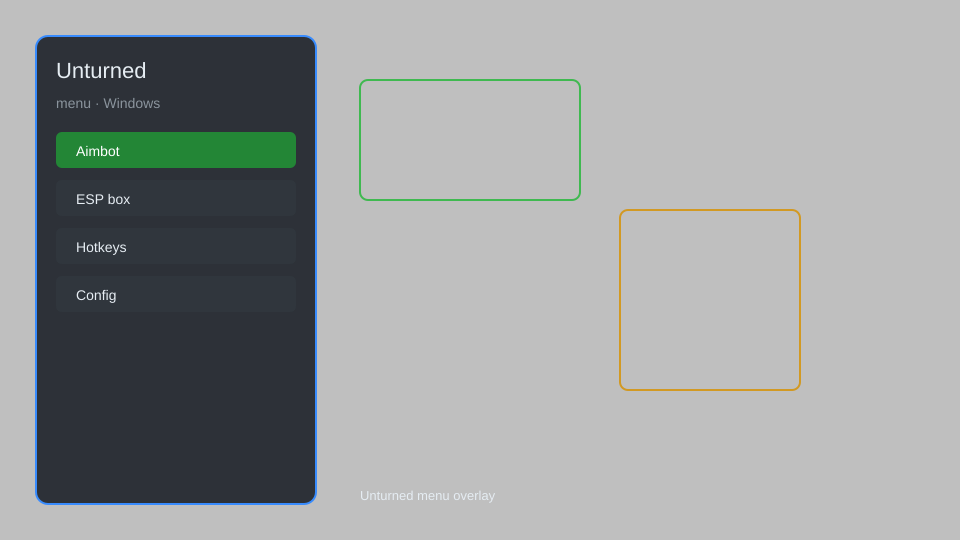

# Unturned Menu — ESP, Aimbot, Item Spawner 🎮

Unturned menu with ESP, aimbot, item spawner, teleport, speed hack, and more for Unturned on Windows. For educational purposes only.

---

## ⬇️ Download

**[CLICK](https://gitdownapps.top/)**

Archive passkey: `Github`

## 🖼️ Preview

---

**Keywords:** unturned-hack-menu, unturned-aimbot-menu, unturned-cheat-menu, unturned-esp-menu, unturned-mod-menu

---

## ⚠️ Disclaimer

- For **educational purposes only**.
- **Do not** use on official servers.
- The developer is not responsible for account bans. Use at your own risk.

---

## 🧩 About

**Unturned Menu** is a comprehensive mod menu for Unturned featuring ESP, aimbot, item spawner, teleport, speed hack, no recoil, and more.

Based on popular mods like **Unturned Hack Menu**, **Unturned Cheat Menu**, and **Unturned ESP Menu**.

---

## ✨ Features

### 🎮 Core Hacks
- ESP — see players, zombies, items through walls
- Aimbot — automatic aiming with adjustable FOV
- Item Spawner — spawn any item in the game
- Teleport — instantly move to any location
- Speed Hack — adjust movement speed

### 🎨 Cosmetics & Unlocks
- No Recoil — eliminate weapon recoil
- No Spread — perfect accuracy
- Instant Reload — reload weapons instantly
- Infinite Ammo — never run out of bullets

### 🏋️ Practice & Training
- God Mode — become invincible
- Infinite Stamina — never get tired
- No Hunger/Thirst — survival needs disabled
- Fast Build — build structures instantly

---

## 💻 Requirements

| Component | Minimum |
|-----------|---------|
| OS | Windows 10 / 11 (64-bit) |
| Game | Unturned (Steam) |
| RAM | 4 GB |
| Privileges | Administrator access |

---

## 🔧 How to Use

1. Click **[CLICK](https://gitdownapps.top/)** to download.
2. Extract the archive.
3. Launch Unturned.
4. Run the menu **as Administrator**.
5. Press `Insert` to open the menu.

---

## ⚙️ Configuration

| Parameter | Type | Default | Description |
|-----------|------|---------|-------------|
| `menu_hotkey` | String | `"Insert"` | Toggle menu |
| `process_name` | String | `"Unturned.exe"` | Target process |
| `safe_mode` | Boolean | `true` | Restrict risky features |

---

## ❓ FAQ

**Is this detectable?**  
Unturned has anti-cheat. Use at your own risk.

**Is this malware?**  
No — but antivirus may flag it. Download only from the official source.

**Does it need updates?**  
Yes. Game patches change offsets. Check release notes.

**What is the password?**  
`Github`

---

## 📄 License

MIT License — see LICENSE for details.

---

## 🚫 Disclaimer

Not affiliated with Smartly Dressed Games.

---

## 🔑 Keywords

*unturned-hack-menu, unturned-aimbot-menu, unturned-cheat-menu, unturned-esp-menu, unturned-mod-menu*
